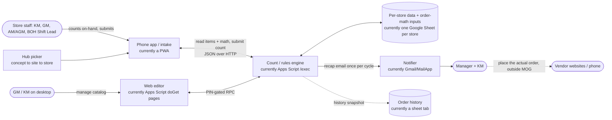

# MOG (Master Ordering Guide): Logic Blueprint

`current_as_of: 7806512 (2026-07-17) · covers: Layers 1 to 3, owner-verified via the blueprint questionnaire`
· maintained in `docs/MOG_LogicBlueprint.md`
<!-- Regenerate the presentable HTML any time with:
     python C:/Users/sebcn/.claude/skills/project-logic-blueprint/scripts/render_blueprint_html.py docs/MOG_LogicBlueprint.md -->

> **Status:** Built from the code, the project docs (`CLAUDE.md`, `docs/MOG_CurrentState.md`, the
> session handoffs), and the owner questionnaire (`docs/MOG_Blueprint_Questionnaire.md`, answered
> 2026-07-17). Every behavioral claim was confirmed in the source or the docs; every "why" was
> confirmed by the owner. A branded HTML rendering, when produced, will not auto-regenerate from
> this markdown.

---

## Layer 1: What this is

### The problem

Every quick-service store has to reorder inventory constantly, and getting the quantity right is
harder than it looks. Order too little and the line runs out mid-rush and has to 86 an item. Order
too much and product spoils, space runs out, or cash is tied up on a shelf. The person who actually
knows what is on hand is a kitchen manager standing in the walk-in with a phone, not someone at a
desk. The math is also non-obvious: a vendor who only delivers twice a week means today's order has
to cover several days, so the "right" number changes by day of week and by vendor. Doing that in
your head, or on a paper sheet, across dozens of items and several vendors, is slow and error-prone,
and it makes a store dependent on the one person who knows how to do it. Spreadsheets alone solve
the math but are miserable to operate one-handed on a phone in a cold room.

### What the system does about it

MOG turns "walk the shelves and figure out what to reorder" into a simple guided phone task:
counting. The user counts what is physically on hand for each item, and the system, which already
knows the target stock level, which vendor delivers when, and how many days this order needs to
cover, tells them the exact quantity to order for each item. It produces a clean suggested order and
emails it to the store's recipients. **MOG does not place orders.** The suggested order is a
handoff: whoever places orders (on vendor websites, by phone) works from that email. The value is
that anyone can do the count, so any competent person can keep a store stocked without inventing
their own process, and a KM can take a vacation without the store suffering.

### What "working" looks like

Someone opens the app on their phone, counts on-hand for a vendor's items, sees a suggested order
quantity appear next to each one, adjusts anything unusual, and submits the count. It takes a few
minutes per vendor. The store's manager and KM get the recap email, use it to place the actual
orders, and the day's counts reset cleanly for tomorrow. Nobody had to open the spreadsheet or do
the coverage math by hand.

### Where it's headed

MOG is one of several operational tools (its internal name is "Order Guides") that Happy Endings
Hospitality may fold into a company-wide operations app or portal alongside a visual schedule, a
prep schedule, and store-reporting tools. The end state is not firmly decided. That uncertainty is
exactly why this document describes MOG's *behavior and rules* independently of its current
implementation (a phone web app plus one Google Sheet per store). The order math, the coverage
model, the multi-vendor sourcing, and the per-store isolation are the durable assets. The Google
Sheet, the Apps Script runtime, and the nine separate deployments are current-platform facts a
rebuild can replace. The stated goal for a rebuild is to capture the logic; the stack is open.

---

## Layer 2: How it works

### Glossary

| Term | Means |
|---|---|
| **Store** | One physical location for one concept (for example Roll Play Rosslyn BOH). Fully isolated: its own data, its own app instance, its own recipients. |
| **Concept** | A restaurant brand under the parent company (Roll Play, Teas'n You, ĂN, Lei'd Poke). Drives theming and a small amount of concept-specific configuration, not different order math. |
| **BOH / FOH** | Back of house (kitchen) vs. front of house. A store is usually split into a BOH guide (mostly food items) and an FOH guide (mostly paper goods). |
| **User** | Anyone doing the count: kitchen managers, general managers, assistant (general) managers, back-of-house shift leads. Counting is the simple task anyone can do so the store is not dependent on one person. |
| **Item** | One thing that can be ordered (an ingredient, a supply). Has a base par, a pack/unit, and belongs to one or more vendors. |
| **Vendor** | A supplier the store buys from. Has a delivery cadence (which days it delivers) that drives the coverage math. |
| **Par (base par)** | The target on-hand quantity for an item for roughly a day. One number per item, shared across every vendor that can supply it. Carries a built-in safety buffer (see R6, R21). |
| **On hand** | The quantity the user physically counts during the session. The only number the user enters. |
| **Day multiplier** | How many days of par this order must cover, for a given vendor on a given weekday, derived from that vendor's delivery cadence. A vendor delivering every third day carries a larger multiplier. |
| **Suggested order quantity** | What the system tells the user to order for an item: enough to bring on-hand up to par times coverage, rounded up to a whole unit, never negative. |
| **Use-multiplier flag** | Per-item switch. When off, the item ignores the day multiplier and orders flat to par (for slow-moving bulk items and fixed-size batch recipes). |
| **Emergency override** | A store-level switch for ordering off the normal delivery schedule; changes coverage from "today's cadence" to "bridge to the next scheduled delivery." |
| **Primary vs. secondary vendor** | An item's default order source is its primary vendor; the same item can also sit on other (secondary/backup) vendor tabs and be ordered from them. All are fully orderable; par is shared. |
| **Pick path / storage area** | The user-defined ordering of items within a vendor, grouped by where they physically sit, so counting follows a walking route. |
| **Count session (the daily order)** | The set of counts plus suggested quantities a user submits for a vendor on a given day. |
| **Recap email** | The auto-generated "today's suggested order" email sent to the store's recipients once per order cycle. The handoff used to place the actual orders. |
| **Reset / new day** | Clearing the day's on-hand counts and snapshotting the completed session to history so the next day starts fresh. |
| **Store PIN vs. master PIN** | The store PIN (the store's street number) gates the phone app and the desktop editor; a separate master PIN gates destructive/admin actions. |
| **Web editor** | A desktop, PIN-gated web app (same URL, different door) where a user manages items, vendors, storage areas, pick path, and views order history. |
| **Hub** | The landing page that routes a user to their concept, site, and store before the store app opens. Prevents one store accidentally using another store's guide. |

### The core flows

#### Flow: Do the daily count (the main event)

- **Triggered by:** A user opening the store app and choosing a vendor to count.
- **What happens:**
  1. The app confirms it is still the same order day. If a new day has started it resets first (see the reset flow) so counts begin clean.
  2. The user picks a vendor. The app shows that vendor's items in the user's chosen walking order (by storage area / pick path).
  3. For each item the user enters the on-hand count (whole or decimal).
  4. As counts are entered, the system computes a suggested order quantity per item: it takes the item's par, scales it by how many days this vendor's order must cover today, subtracts what is on hand, and rounds up to a whole unit. Items where the vendor does not deliver today, or where on-hand already meets coverage, show nothing to order.
  5. The user reviews the vendor's full suggested order, adjusts any quantity, and submits the count.
  6. The session is recorded and the recap email goes to the store's recipients (once per cycle, no duplicates).
- **Ends with:** A submitted count for that vendor, a recap email on its way, and the user free to count the next vendor. The actual purchase happens later, outside MOG, from the recap.

#### Flow: New-day reset

- **Triggered by:** The first app open of a new order day (auto), or the Sheet being opened on a new day (auto, via the store's dashboard), or a manual dashboard control in the Sheet.
- **What happens:**
  1. The system detects the stored "last order day" is behind today.
  2. It snapshots the completed session to history and sends the recap email if it has not already gone out for that cycle.
  3. It clears the day's on-hand counts so every item starts uncounted.
  4. It clears the emergency-override switch, since a new day is back on the normal schedule.
- **Ends with:** A fresh order day; the user sees a clean count screen. The reset is what guarantees the recap gets sent and the day gets logged.

#### Flow: Multi-vendor sourcing

- **Triggered by:** A user counting a vendor whose items are also available from other vendors, or a GM assigning an item to more than one vendor.
- **What happens:**
  1. An item can appear on several vendor tabs at once, sharing one par.
  2. One vendor is the item's primary (default source); the others are secondary/backup and are labeled as such but are fully orderable.
  3. Because each vendor tab tracks its own on-hand for the item, the user orders from whichever vendor makes sense that day (the one delivering, the one in stock, or the cheaper one this week). The per-tab on-hand is what routes the order.
- **Ends with:** The user can order the same item from any of its vendors without duplicating the item or recomputing par, and can recover from a stock-out by switching to a backup.

#### Flow: Manage the catalog (web editor)

- **Triggered by:** A user opening the desktop web editor and entering the store PIN.
- **What happens:**
  1. From a home dashboard they open a tool: Manage Items, Manage Vendors, Storage Areas, Shelf-to-Sheet (pick path), or Order History (read-only).
  2. They add/edit items (par, pack, use-multiplier, which vendors can supply it), add or import vendors with delivery days, arrange storage areas and the counting route, and review past orders.
  3. Changes write back to the store's data and show up on the phone app.
- **Ends with:** The store's catalog and layout updated without anyone editing the raw spreadsheet.

#### Flow: First-run store setup and health check

- **Triggered by:** A brand-new store's app URL being opened before it is configured, or a manager running the Store Health Check.
- **What happens:**
  1. Setup (unconfigured store only) collects identity (concept, front/back of house, city) and derives the store name and code, then marks the store configured.
  2. The Health Check is a read-only diagnostic that inspects the store's structure (config, vendor tabs, formulas, catalog consistency) and reports pass/warn/fail, with one-click fixes for a set of known repairs.
- **Ends with:** A store ready to take counts, or a manager with a clear list of what to fix.

### How the parts connect



### The rules

*Enumerated so the rebuild spec can cite them. This is the highest-value section: these are what a
naive rebuild silently loses.*

- **R0. MOG produces a suggested order; it does not place orders.** The output is the count session
  plus the recap email; the actual purchase happens externally (vendor websites/phone) from that
  recap. *(Owner-confirmed.)*
- **R1. Suggested order quantity = round-up( par × coverage − on-hand ), never below zero.** If the
  result is zero or negative, the item shows nothing to order. *(Confirmed: `computeSuggestedQty_`,
  `MOGApi.gs`.)*
- **R2. Coverage = the vendor's day multiplier for today**, unless the item's use-multiplier flag is
  off, in which case coverage is a flat 1 (order straight to par). *(Confirmed:
  `computeSuggestedQty_`, `readMasterItemMeta_`.)*
- **R3. If a vendor's multiplier for today is 0, that vendor does not deliver today**: its items show
  nothing to order and are effectively out of the day's ordering. *(Confirmed: `vendorDayMultiplier_`
  returning 0, `computeSuggestedQty_` returning null.)*
- **R4. Always round the order up to a whole unit.** Two reasons: you never intend to order short
  (running out mid-service is worse than a little extra), and vendors sell whole units (you cannot
  buy 0.25 of an item). *(Confirmed: `Math.ceil`; owner-confirmed why.)*
- **R5. On-hand may be a decimal; par and the order are quantities in the item's pack/unit.**
  *(Confirmed: PWA decimal input, `Number()` on save.)*
- **R6. Par is one number per item, shared across every vendor that can supply it**, not a per-vendor
  par. The day multiplier, not a second par, handles vendor-specific coverage. This lets a user
  compare vendor prices and switch sources without duplicating the item or recomputing a new par, and
  lets a backup vendor cover a stock-out. *(Confirmed: par from `MASTER_ITEMS` col G; owner-confirmed
  why.)*
- **R7. An item can belong to multiple vendors; one is primary (default source), the rest are
  fully-orderable backups.** Placing an item on a vendor tab is what makes that vendor eligible.
  *(Confirmed: primary = col C, eligible list = col O; `syncItemEligiblePickRows_`.)*
- **R8. Per-vendor on-hand routes multi-vendor ordering.** The same item counted on two vendor tabs
  is two independent on-hand counts, so the user orders from whichever vendor is right that day. The
  system does not pick the vendor; the user does. *(Confirmed: vendor-tab structure; owner-confirmed
  intent.)*
- **R9. Reassigning an item's primary vendor promotes in place**: the old primary stays on as a
  backup rather than being removed, because it is still a valid source you will likely want again.
  *(Confirmed: `commitSwitchActiveVendor`; owner-confirmed why.)*
- **R10. Emergency override changes coverage from "today's cadence" to "bridge to the next
  delivery"**: scan forward from today for the first day the vendor delivers and use that day's
  multiplier; a vendor that delivers today is unaffected; a vendor that never delivers falls back to
  1× so the user can still order. *(Confirmed: `vendorDayMultiplier_` override branch.)*
- **R11. Emergency override is store-wide, any user can turn it on (with a confirm), and it clears on
  the next reset.** It is for vendor-cadence disruptions such as a holiday landing on a delivery day;
  vendors tend to share delivery days, so applying it store-wide keeps it simple, and it is an
  operational call rather than an admin action. *(Confirmed: `api_setEmergencyOverride_`, reset
  clears it; owner-confirmed why.)*
- **R12. The recap email is sent exactly once per order cycle**, as a guaranteed side effect of the
  session/reset, regardless of which path triggered it. It goes to the manager and the KM: one counts,
  the other (or the same person later) places the orders from the email, and it doubles as an
  accountability record of what the par said to order. *(Confirmed: `sendRecapIfUnsent_` dedupe gate;
  owner-confirmed purpose. Retry-on-failure is a desired change, see edge cases and Q-INT-1.)*
- **R13. A new order day auto-resets on first contact** (app open or sheet open); there is no manual
  mid-day reset. Auto-reset is also what guarantees the recap gets sent and the day gets logged.
  *(Confirmed: reset flow; the manual button was deliberately removed.)*
- **R14. Counts entered while offline are queued and must flush before a new-day reset wipes them.**
  This is a hard requirement: never lose a user's counts to a bad connection. *(Confirmed:
  `drainSaveQueue_` awaited by `runStaleReset_`; owner-confirmed hard requirement.)*
- **R15. The store PIN gates the app and the editor; a separate master PIN gates destructive/admin
  actions.** After repeated wrong PINs the store locks out for a cooldown window. The store PIN is the
  store's street number: easy for anyone on shift, and paired with the hub picker it stops one store
  from accidentally using another store's guide. Shift leads can use it because they have no company
  email. *(Confirmed: `checkPin_`, lockout; owner-confirmed why.)*
- **R16. Every store is strictly isolated**: one store's app only ever sees its own items, vendors,
  orders, and recipients. A user has no need to see another store's ordering, and it keeps the app
  simple. *(Confirmed: per-store Sheet + per-store deployment; owner-confirmed why.)*
- **R17. Item catalog, vendor delivery cadence, storage areas, and the pick path are store-owned
  data, not code.** Identical software runs every store; all per-store difference lives in the store's
  data. *(Confirmed: invariant #3.)*
- **R18. Storage areas and the pick path preserve the user's chosen order; other lists (vendors in
  pickers, catalog, recipients) sort alphabetically.** The pick path is a physical walking route, so
  its order is meaningful. *(Confirmed: 2026-07-16 alphabetize work; areas/pick-path left
  user-ordered.)*
- **R19. Par-review flags over- and under-ordering from order history**, as an informational nudge
  only; the GM/KM makes the final call because they know what the operation actually needs. An
  over-flag only fires when there is a whole unit's worth to trim (guardrails so it is not noisy).
  *(Confirmed: `History.gs` par-review; over-flag floors + 75% on-hand cutoff; owner-confirmed
  informational-only.)*
- **R20. The use-multiplier flag is off for slow-moving bulk items and fixed-size batch recipes.**
  Bulk items that cannot be ordered in smaller quantities, or are cheaper in bulk and do not spoil
  quickly, and batch recipes made to a set size, should not be scaled up by the day multiplier. The
  point is to avoid over-ordering them. *(Confirmed: `readMasterItemMeta_` honors col M;
  owner-confirmed which items.)*
- **R21. Par is a roughly-one-day par with a deliberate safety buffer.** It is not a literal single
  day's usage: it accounts for order cutoff times (you order mid-day, before the day is done, so some
  counted stock will still get used), for busy-day and catering spikes, and for a vendor being out of
  a needed item. In practice a "one-day" par behaves more like a 1.5 to 2 day par. *(Owner-confirmed;
  this is why suggested quantities are intentionally not cut to the bone.)*
- **R22. Within a concept the item list should be standardized; par, vendor cadence, and vendor
  selection vary by store.** Every store of a concept ideally orders the same catalog of items; what
  legitimately differs per store is the par (driven by that store's sales and product mix), the
  delivery cadence with its vendors, and sometimes the vendors themselves (some vendors are not
  available in every region). *(Owner-confirmed intent. Not enforced today: each store's catalog is
  currently built by hand, so standardization is a goal, not a guarantee. See growth seams.)*

---

## Layer 3: Rebuild spec

*From here the reader is a developer on any stack, rebuilding MOG's behavior without its source.*

### Data model

*Conceptual entities. In the current implementation these map to tabs/columns in one Google Sheet
per store; a rebuild would model them as tables. Column letters are breadcrumbs only.*

#### Entity: Store (one per location; the whole dataset is scoped to it)
| Field | Type (conceptual) | Notes |
|---|---|---|
| slug | identifier | Immutable once published (bookmarks/home-screen icons depend on it). |
| concept | enum | Roll Play / Teas'n You / ĂN / Lei'd Poke. Drives theming plus minor config. |
| location name | text | Display name, for example "Rosslyn BOH". Encodes BOH vs. FOH. |
| store PIN | secret | The store's street number. Gates app + editor. |
| master PIN | secret | Gates destructive/admin actions. |
| recipients | list of {name, email, locked?} | Who gets the recap email; one may be GM/locked-first. |
| configured? | boolean | False until first-run setup completes. |

#### Entity: Item
| Field | Type (conceptual) | Notes |
|---|---|---|
| item id | identifier | Stable key (MASTER_ITEMS col A). |
| name | text | col B. |
| pack / unit | text | col E. |
| base par | number | col G. Shared across all the item's vendors (R6). Carries a safety buffer (R21). |
| primary vendor | vendor ref | col C. Default order source (R7). |
| eligible vendors | list of vendor refs | col O. Every vendor that can supply it (R7). |
| use-multiplier | boolean | col M. Off = order flat to par, for bulk/batch items (R20). |
| active | boolean | col L. |
| notes | text | col N. |

#### Entity: Vendor
| Field | Type (conceptual) | Notes |
|---|---|---|
| name | identifier (per store) | Also the vendor-tab header, which drives its item spine. |
| delivery cadence | 7 day-multipliers | One multiplier per weekday; 0 = no delivery that day (R3). Drives coverage (R2). |
| cutoff time | time or null | Order-by time (informational). Part of why par carries a buffer (R21). |

#### Entity: Count line (per item, per vendor, per day)
| Field | Type (conceptual) | Notes |
|---|---|---|
| item id + vendor | composite ref | Each (item, vendor) tracks its own on-hand (R8). |
| on hand | number (decimal ok) | The user's count (R5). |
| suggested qty | number | Derived, not stored raw; computed via R1. |
| storage area + position | area ref + order | The user's walking route (R18). |

#### Entity: Order history record
| Field | Type (conceptual) | Notes |
|---|---|---|
| order date | date | Order cycle it belongs to. |
| vendor | vendor ref | |
| item + qty ordered | list | Only lines with a positive suggested qty are logged (see edge cases). |
| on-hand at time of count | number | Feeds par-review (R19) and usage history. |

#### Entity: Store state (order-cycle bookkeeping)
| Field | Type (conceptual) | Notes |
|---|---|---|
| active order date | date | The current cycle; "new day" = today past this (R13). |
| last recap sent date | date | Dedupe gate for the recap (R12). |
| emergency override | boolean | Store-wide; clears on reset (R11). |

### Flow contracts

#### Contract: Compute suggested order quantity (the heart of the system)
- **Inputs:** item base par; item use-multiplier flag; the vendor's multiplier for today; the user's on-hand count.
- **Validations:** par present and numeric; day multiplier > 0; on-hand present.
- **Logic (language-neutral pseudocode):**
  ```
  effectiveMult = useMultiplier ? vendorDayMultiplier(vendor, today) : 1
  if par is not a number OR effectiveMult <= 0 OR onHand is missing: return NOTHING_TO_ORDER
  qty = roundUp(par * effectiveMult - onHand)
  return qty > 0 ? qty : NOTHING_TO_ORDER
  ```
- **Outputs / side effects:** a per-item suggested quantity on the count screen; no persistence until submit.
- **On failure / missing data:** any missing input returns NOTHING_TO_ORDER (item shows blank), never a wrong number.
- **Rules applied:** R1, R2, R3, R4, R5, R21.

#### Contract: Vendor day multiplier
- **Inputs:** the vendor's 7-day cadence; today's weekday; the emergency-override flag.
- **Logic:**
  ```
  m = cadence[vendor]; if none: return 0
  if not emergencyOverride: return m[today] or 0        // 0 = no delivery today
  // emergency override: bridge to the next delivery
  for i in 0..6:
     v = m[(today + i) mod 7]
     if v > 0: return v
  return 1                                              // never-delivers fallback
  ```
- **Rules applied:** R3, R10, R11.

#### Contract: Submit a daily count
- **Inputs:** vendor; the per-item on-hand counts (and any user-adjusted quantities).
- **Validations:** same-day check; offline queue drained first (R14).
- **Outputs / side effects:** lines with positive suggested qty logged to history; recap email sent if not already sent this cycle (R12); on-hand persisted.
- **On failure:** the submit runs under an extended timeout; if the client aborts but the server finished, the app re-checks status and enters the app rather than double-submitting or stranding the user.
- **Rules applied:** R0, R12, R14.

#### Contract: New-day reset
- **Inputs:** active order date vs. today.
- **Logic:** if today > active order date: snapshot session to history, send recap if unsent, clear on-hand counts, clear emergency override, set active order date = today.
- **On failure:** re-poll status; enter the app if the server completed despite a client abort.
- **Rules applied:** R12, R13, R14, R11.

#### Contract: Reassign an item's primary vendor
- **Logic:** flip the item's primary vendor to the target; keep every existing eligible/backup vendor; ensure the new primary has a pick row; the former primary stays as a backup.
- **Rules applied:** R7, R9.

### Edge cases and why

*The why is the payload. A rebuilder without it will "fix" deliberate behavior.*

| Behavior | Why |
|---|---|
| Order quantities always round up, never down. | You would rather have a little extra than 86 an item mid-service, and vendors sell whole units so a fractional need has to become the next whole pack. |
| Par is per-item, not per-vendor; vendor differences are handled by the day multiplier only. | So a user can compare vendor prices and switch sources without duplicating the item or recomputing a par, can see at a glance where else an item is available, and can recover from a stock-out by ordering from a backup. One number also cannot drift between vendors. |
| Par is a "one-day" par but is intentionally sized to about 1.5 to 2 days. | Orders are placed mid-day before vendor cutoff times, so some counted stock still gets used before delivery; the buffer also absorbs busy-day and catering spikes and a vendor being out of an item. Cutting par to a literal single day would cause run-outs. |
| Suggested quantity is blank when the vendor does not deliver today. | You order to cover only until the next delivery (usually next-day). A restaurant has limited space for perishables and values freshness, so ordering more than needed causes waste and ties up cash. |
| The use-multiplier flag is off for bulk and batch-recipe items. | Bulk items you cannot order smaller, or that are cheaper in bulk and do not spoil, and set-size batch recipes, should not scale up by day; scaling them just over-orders. |
| Emergency override bridges to the next delivery instead of a flat 1×. | A flat 1× order cannot tide a store over to a vendor's next scheduled drop when the schedule is disrupted (for example a holiday on a delivery day); covering the gap is what "emergency" actually needs. |
| Emergency override is store-wide and any user can flip it. | Vendors tend to share delivery days, so a disruption usually hits all of them at once, and turning it on is an operational call, not an admin one. |
| The manual "start the new day" button was removed; reset is automatic. | It was pure friction; auto-reset on first open already covers a new day and is what guarantees the recap sends and the day logs. |
| Secondary/backup vendors are fully orderable, not reference-only. | A user needs to order from a backup when the primary is out of stock or not delivering that day, or when the backup is cheaper this week. |
| Only lines with a positive suggested quantity are logged. | History records what was actually meant to be ordered, not zero rows, which keeps the usage history clean. |
| Offline counts must flush before reset. | A user on a flaky connection must never lose a count to an auto-reset that fires first. |
| Storage areas and pick path stay in the user's manual order; everything else sorts A to Z. | The pick path is a physical walking route through the store; alphabetizing it would defeat the purpose. |
| Same identical code ships to every store; all per-store difference is data. | Nine stores cannot each carry a code fork; isolation (R16) keeps a user out of other stores' data. |
| The recap should retry on send failure, but still land at most once per cycle. | The recap is the handoff used to place real orders and an accountability record, so a silent miss is costly; today it is once-and-done with no retry, and adding a bounded retry is a desired change (Q-INT-1). |

### Integration contracts

| Integration | Direction | Payload | Frequency | If it's down |
|---|---|---|---|---|
| Phone app and count engine | Both | JSON: items + math down, count submission up | Every count/submit | App shows "Offline"; counts queue locally and flush on reconnect (R14). |
| Web editor and count engine | Both | PIN-gated RPC calls | Per editor action | Editor unusable until back; no data loss (edits are explicit saves). |
| Count engine to recipients | Out | Recap email ("today's suggested order") | Once per order cycle | The session still records; recipients do not get the email. Desired: retry on failure, still capped at once per cycle (Q-INT-1). |
| Recipients to vendors | Out (outside MOG) | The actual purchase order | Per order | Not a MOG boundary; MOG's job ends at the recap. Documented so a rebuilder does not try to place orders from MOG. |
| Count engine and per-store storage | Both | Item/vendor/count reads and writes | Continuous | The store cannot operate; this is the system of record. |
| **Future:** MarginEdge | In (planned) | Item catalog to seed a store's item list, plus item / waste cost | TBD | Not built. Highest-leverage integration: reduces the manual store-setup labor. See growth seams. |
| **Future:** Toast (POS) | In (planned) | Sales / usage to inform pars | TBD | Not built; see growth seams. |

### Configuration and constants

| Setting | Controls | Business or technical |
|---|---|---|
| Base par (per item) | Target stock level plus safety buffer; the anchor of every suggested qty | **Business** |
| Vendor delivery cadence (7 multipliers) | Which days a vendor delivers and coverage per weekday | **Business** |
| Use-multiplier flag (per item) | Whether an item scales by coverage or orders flat to par | **Business** |
| Emergency override | Off-schedule ordering (bridge-to-next-delivery) | **Business** (operational switch) |
| Recipients list | Who gets the recap email | **Business** |
| Store PIN (street number) / master PIN | App + admin access | **Business** |
| Over-flag on-hand cutoff (75%) and whole-unit floors | Par-review noise threshold | **Business decision encoded as a knob** |
| Par-review window / min-orders (28 days / 3 orders) | How much history before flagging | Technical tuning of a business signal |
| PIN lockout threshold + cooldown | Brute-force protection | **Technical** |
| Cache TTLs, mutation timestamps | Read freshness vs. speed | **Technical** (platform note) |

### Growth seams

- **Automate new-store onboarding (the biggest current constraint).** Standing up a new store today
  is heavily manual: someone creates the store's Google Sheet, hooks it into the backend so the app
  works, then hand-enters every vendor and every item. That manual build is the single largest source
  of friction and the thing a rebuild should most reduce. The seam is a store-provisioning flow that
  creates a store and seeds its catalog with little or no hand entry. The Import Vendor feature in
  Manage Vendors is the existing partial step toward this, and it is meant to draw from MarginEdge
  (below) rather than being typed in by hand.
- **Seed the catalog from MarginEdge.** Beyond cost, MarginEdge should be able to populate a store's
  item list, so onboarding a store becomes "pull the items" instead of "type in the items." This is
  the same data path as cost/sales below and is the highest-leverage integration for reducing setup
  labor. The Item entity is where seeded items land; the concept-standardization model (R22) is what
  they should conform to.
- **Standardize the catalog per concept (R22).** Every store of a concept should share one item list,
  with par, cadence, and vendor selection varying per store. The natural shape is a per-concept master
  catalog that each store inherits and then tunes (its own pars from its sales/product mix, its own
  vendor cadence, its own regionally-available vendors). Today each store's catalog is built
  independently, so this is a design target, not current behavior; a rebuild should make the concept
  catalog a real, inheritable entity.
- **Cost and sales integration.** Pull cost from MarginEdge and sales/usage from Toast so pars can be
  informed by real data and the recap can carry cost. The count engine is where these land; the Item
  and Order-history entities are where cost/usage fields attach. The goal is a plug-and-play system
  strong enough that KMs and GMs spend their time training people rather than on recurring manual
  tasks.
- **Par intelligence.** Par is currently a hand-set number with a manual safety buffer; the
  par-review flags are the seed of a system that could recommend par changes from history plus sales,
  while leaving the final call to the GM/KM (R19).
- **One portal, many tools.** MOG may become a module in a company-wide operations app alongside the
  visual schedule, prep schedule, and store reports. Whether they share one login and one
  people/store system is not yet decided, so the Store entity, the PIN/access model, and the
  recipients list should be built to be swapped for a shared identity/roster later.
- **Editability and per-concept flexibility.** A stated pain with the current version is how hard it
  is to adjust behavior per concept and to edit safely; a rebuild should make store/concept
  configuration a first-class, low-risk activity.

### Platform notes (safe to drop on rebuild)

*Everything here is an accommodation of the current stack (a PWA plus Google Apps Script plus one
Google Sheet per store). A rebuild on another stack can drop all of it and lose zero business
behavior.*

- **Order math was migrated out of sheet formulas into code** so the count path no longer depends on
  reading a live spreadsheet's formula cells. On a real database this whole concern disappears; the
  math (R1 to R3, R10) is the asset, not where it runs.
- **Nine separate deployments** (8 stores plus a master template), identical code, config-in-data.
  This is how the current platform does multi-tenancy; a rebuild would use one app with a store
  dimension in the data. The isolation (R16) is a rule; the nine deployments are a workaround.
- **Offline support is limited** by what a PWA plus service worker can cache and queue. Improving
  offline resilience is a stated goal; the requirement (R14, never lose counts) is the durable part.
- **"Push" vs. "redeploy"**: the phone app reads a versioned snapshot of the backend, so backend
  changes need an explicit version bump. Pure deployment mechanics.
- **Service-worker cache versioning**: the phone app caches its shell; a version bump evicts stale
  copies. PWA-specific.
- **Execution-time limits, cache TTLs, lock service, mutation timestamps, batched reads/writes**: all
  present to stay within Apps Script quotas and to serialize concurrent edits on a Sheet. A
  transactional database makes these moot.
- **Web editor served from the same URL via a different route (`doGet?page=…`), PIN-gated,
  desktop-only, token in the URL across page loads**: a consequence of hosting the editor inside the
  same Apps Script web app as the phone API. A rebuild would just have an authenticated admin UI.
- **Vendor "tabs," a hidden vendor template, a B1 header driving the item spine, storage-area and
  pick-path stored in SETUP columns**: spreadsheet-shaped storage. The entities in the data model
  above are the durable form.

---

## Resolved owner questions

All ASSUMED flags from the draft were resolved on 2026-07-17. The one open item:

- **Q-INT-1 (recap retry):** The recap should retry on a send failure but still land at most once per
  cycle. Current behavior is once-and-done with no retry. This is a desired behavior change, tracked
  here so a rebuild builds it in and the current implementation can add a bounded retry.
